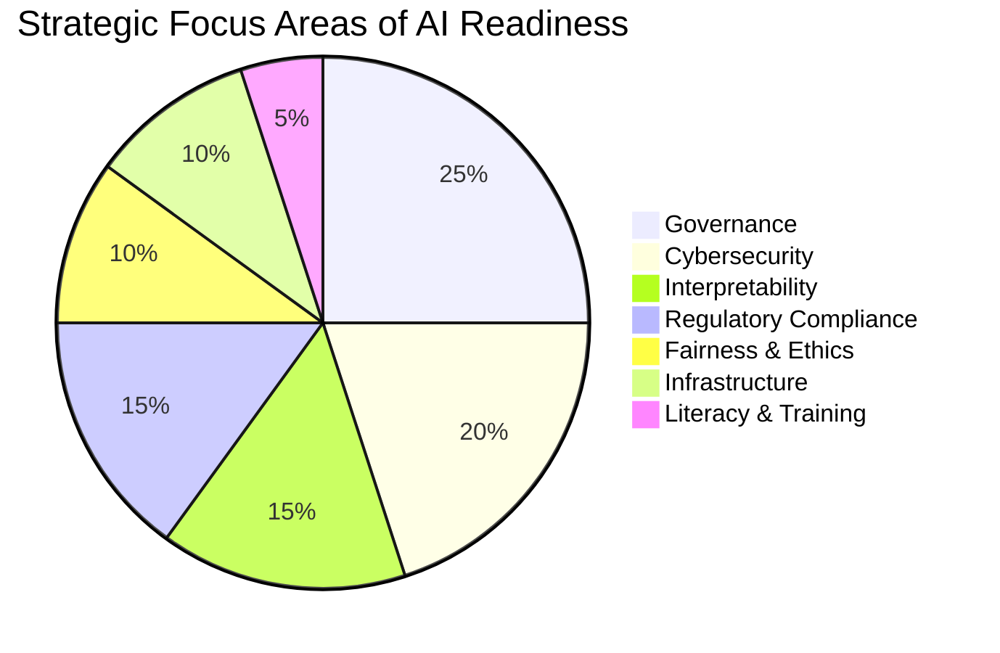
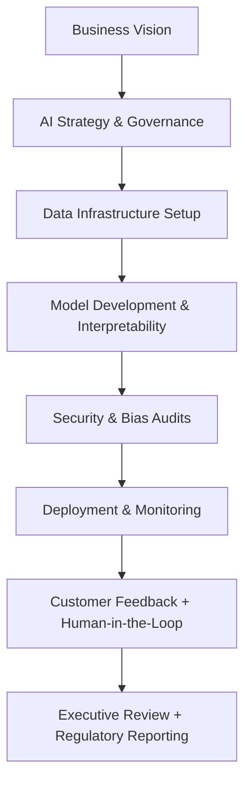

# AI Readiness for C-Suite Leaders

## 📑 Table of Contents

1. [Executive Summary](#executive-summary)
2. [AI Governance Frameworks](#ai-governance-frameworks)
3. [Mechanistic Interpretability & Explainable AI](#mechanistic-interpretability--explainable-ai)
4. [Cybersecurity Risks in AI Systems](#cybersecurity-risks-in-ai-systems)
5. [Regulatory Compliance](#regulatory-compliance)
6. [Bias, Ethics, and Fairness](#bias-ethics-and-fairness)
7. [Customer Trust & Transparency](#customer-trust--transparency)
8. [Human-in-the-Loop Architecture](#human-in-the-loop-architecture)
9. [Responsible Data Use & Provenance](#responsible-data-use--provenance)
10. [Infrastructure Planning for Scalable AI Ops](#infrastructure-planning-for-scalable-ai-ops)
11. [Cross-functional AI Literacy](#cross-functional-ai-literacy)
12. [Mermaid Visuals](#mermaid-visuals)
13. [90-Day Executive AI Readiness Roadmap](#90-day-executive-ai-readiness-roadmap)
14. [Resource Recommendations](#resource-recommendations)

---

## Executive Summary

AI is reshaping every industry — and the readiness of leadership teams will determine whether organizations thrive or fall behind. As a new C-suite executive, your role is not only to understand what AI *does*, but how it *thinks*, *fails*, *learns*, and *scales*. This guide walks through governance, ethics, security, interpretability, and infrastructure — all through the lens of executive responsibility.

---

## AI Governance Frameworks

* **NIST AI Risk Management Framework (RMF)**: Focus on mapping, measuring, and managing AI risks
* **OECD AI Principles**: International norms for trustworthy AI
* **ISO/IEC 42001**: New global standard for AI management systems

A mature AI governance approach is a key board-level concern.

---

## Mechanistic Interpretability & Explainable AI

Executives must ask: *"Can we explain our model’s decisions to regulators, customers, and ourselves?"*

* Tools like LIME, SHAP, and counterfactuals enable this
* Mechanistic interpretability goes deeper — reverse engineering how neural networks reach conclusions

High-stakes industries (e.g., finance, healthcare) require interpretability for compliance and trust.

**Example:** In healthcare diagnostics, being able to explain why an AI flagged a tumor as malignant versus benign can be the difference between trust and rejection by clinicians.

---

## Cybersecurity Risks in AI Systems

AI introduces new threat surfaces:

* **Model poisoning**
* **Data leakage**
* **Adversarial attacks**

Secure your pipelines, not just your predictions.

---

## Regulatory Compliance

* **EU AI Act** (2025): Classifies systems by risk and imposes transparency, documentation, and auditability requirements
* **U.S. Executive Order (2023)**: Emphasizes safety testing, watermarking, and cybersecurity controls

Stay ahead of compliance to avoid product disruption or fines.

---

## Bias, Ethics, and Fairness

* Implement pre- and post-model bias audits
* Build diverse model training teams
* Include ethical risk scoring in project reviews

Fairness is not just a value — it's a business differentiator.

---

## Customer Trust & Transparency

* Publish clear AI disclosures in UX
* Include opt-out mechanisms where possible
* Avoid "black box" interfaces in high-impact use cases

**Best Practice Example:** Salesforce includes detailed model behavior summaries in their Einstein Analytics tools, giving admins more visibility and control.

Transparency directly impacts adoption.

---

## Human-in-the-Loop Architecture

Not every decision should be fully automated. Key applications should allow for:

* Override mechanisms
* Human review checkpoints
* Continuous feedback loops

**When to Use:** In fraud detection or insurance claim review, letting humans intervene reduces false positives while allowing models to learn from human input.

---

## Responsible Data Use & Provenance

* Track data lineage across sourcing, labeling, and training
* Document data contracts and usage boundaries
* Leverage synthetic data ethically

Data hygiene is foundational to ethical AI.

---

## Infrastructure Planning for Scalable AI Ops

* MLOps (CI/CD for ML): Automate deployment, monitoring, rollback
* Hybrid cloud vs. on-prem decision-making
* AI observability tools (e.g., Arize, Fiddler)
* **Tooling to Know:** MLFlow for tracking, Kubernetes for orchestration, DVC for dataset versioning

---

## Cross-functional AI Literacy

Executives should understand:

* Model lifecycle basics
* Terminology like overfitting, drift, inference latency
* How AI affects compliance, finance, HR, and ops

**Quick Upskill Tools:**

* Google’s Machine Learning Crash Course
* MIT Sloan’s AI for Business short course
* NIST’s AI Literacy Playbook

AI readiness is a C-suite sport.

---

## Mermaid Visuals

### 🎯 AI Strategic Readiness Focus (Pie Chart)

### 🔁 AI Readiness Workflow (Flowchart)

---

## 90-Day Executive AI Readiness Roadmap

**Days 1–30**: AI Literacy + Governance Alignment

* Conduct board-level AI literacy sessions
* Evaluate current systems for auditability & documentation gaps

**Days 31–60**: Risk, Infrastructure, Security

* Launch internal AI risk assessment
* Choose and deploy observability stack
* Review cybersecurity posture

**Days 61–90**: Transparency + Strategy Activation

* Publish AI use policy & transparency pledge
* Define ethical guardrails per use case
* Finalize cross-functional roadmap and KPIs

---

## Resource Recommendations

* NIST AI RMF: [https://www.nist.gov/itl/ai-risk-management-framework](https://www.nist.gov/itl/ai-risk-management-framework)
* World Economic Forum – AI Governance: [https://www.weforum.org/centre-for-the-fourth-industrial-revolution](https://www.weforum.org/centre-for-the-fourth-industrial-revolution)
* MIT Sloan Management Review – AI Research: [https://sloanreview.mit.edu/tag/artificial-intelligence/](https://sloanreview.mit.edu/tag/artificial-intelligence/)

---

**Written by:** An executive strategist trained in AI systems, governance, and ethical innovation.

---
